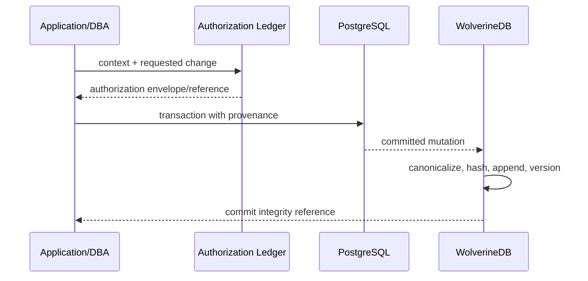
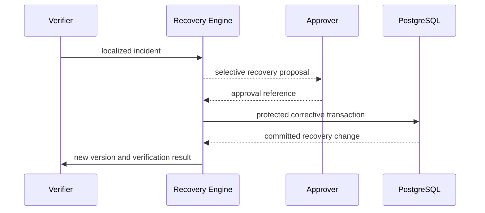

# Sequence diagrams

## Committed change

```mermaid
sequenceDiagram
  participant A as Application/DBA
  participant Z as Authorization Ledger
  participant P as PostgreSQL
  participant W as WolverineDB
  A->>Z: context + requested change
  Z-->>A: authorization envelope/reference
  A->>P: transaction with provenance
  P-->>W: committed mutation
  W->>W: canonicalize, hash, append, version
  W-->>A: commit integrity reference
```

## Recovery

```mermaid
sequenceDiagram
  participant V as Verifier
  participant R as Recovery Engine
  participant O as Approver
  participant P as PostgreSQL
  V->>R: localized incident
  R-->>O: selective recovery proposal
  O-->>R: approval reference
  R->>P: protected corrective transaction
  P-->>R: committed recovery change
  R->>V: new version and verification result
```
