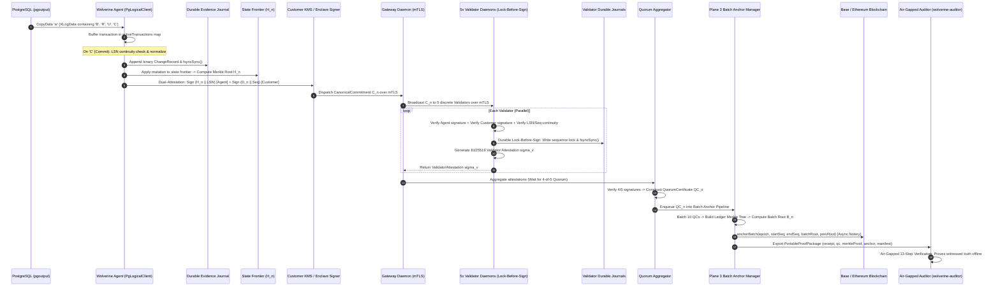
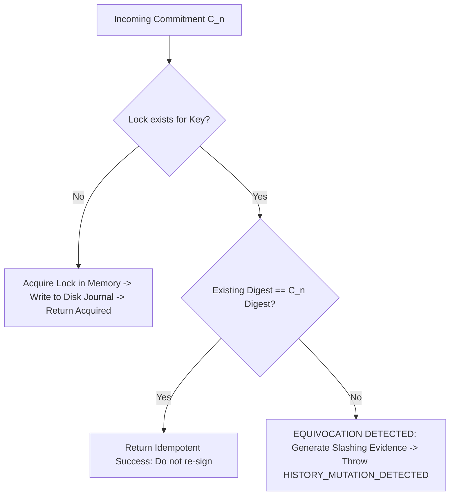
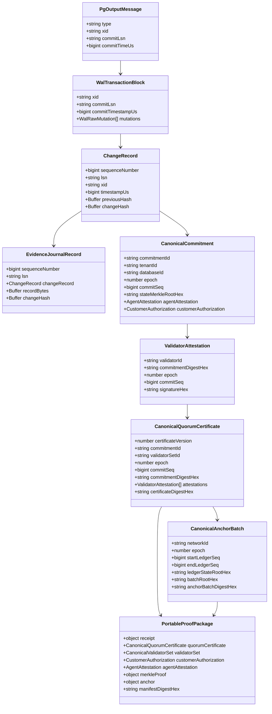
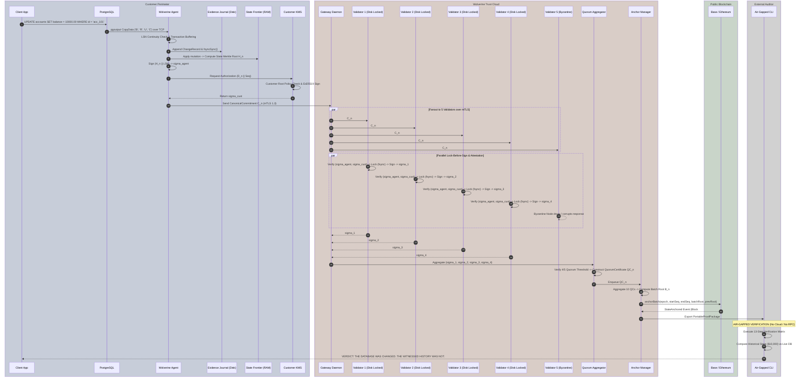

# WolverineDB: End-to-End Architectural Dataflow & Codebase Reverse-Audit

> **Canonical Document**: `docs/WOLVERINE-CODEBASE-DATAFLOW.md`  
> **Repository Baseline**: WolverineDB v2.0 Protocol (Milestones 1–6 Complete)  
> **Test Baseline**: 114 test files / 292 tests / 100% passing  
> **Nature of Document**: Grounded codebase reverse-architecture audit. Describes actual types, call paths, persistence boundaries, network boundaries, and cryptographic transformations as implemented in `src/`. Distinguishes between production-grade enforcement, cryptographic abstractions, and simulated components.

---

## PART 1 — Repository Topology & Directory Anatomy

```
wolverine-db/
├── src/
│   ├── adapters/                     # Legacy database shim layer (v0.3 prototype)
│   ├── anchors/                      # Plane 3: Batch anchoring, EVM smart contracts, consensus
│   ├── bft_hardening/                # Milestone prototype: Collusion defense, key rotation
│   ├── binary/                       # Core RFC 8785 canonicalization, binary encoders/decoders
│   ├── checkpoint/                   # Checkpoint storage abstractions (Local, S3, WORM)
│   ├── cli/                          # CLI entry point
│   ├── continuous_reconstruction/    # Continuous state reconstruction & dependency graph (v0.7)
│   ├── crypto/                       # Ed25519 signing providers, SHA-256, Merkle trees, KMS shims
│   ├── daemons/                      # Process-separated daemon entrypoints (M3) + legacy daemons
│   ├── demo/                         # Cinematic demonstration scripts
│   ├── engine/                       # Equivalence engines & provenance verifiers
│   ├── errors/                       # WolverineErrorCode enumeration and typed error models
│   ├── evidence/                     # Plane 1: Journaling, StateFrontier, Checkpoints, Snapshot
│   ├── fabric/                       # Incident coordination & risk correlation engine (v0.5)
│   ├── federation/                   # Multi-cluster federated trust shims (v0.6)
│   ├── hardening/                    # Milestone 6: Fuzzers, Torn-write sims, Admission, Model checker
│   ├── network/                      # Milestone 3: X.509 PKI generator, Mandatory mTLS RPC client/server
│   ├── postgres/                     # DEPRECATED: Trigger-based capture & raw pg adapters
│   ├── proof/                        # Milestone 5: Portable Proof Package Builder & 13-step Verifier
│   ├── protocol/                     # Protocol types and wire formats
│   ├── reconstruction/               # Milestone prototype: Historical replay engine & manifests
│   ├── runtime/                      # Distributed runtime cluster & temporal ordering shims
│   ├── sdk/                          # Client SDK bindings
│   ├── sentinel/                     # Sentinel behavioral anomaly detection engine (v0.4)
│   ├── survivability/                # Milestone 4: DisasterQueue, HistoryVerifier, Cold Recovery
│   ├── trust/                        # Plane 2: Commitments, Locks, Journal, Validator SM, Quorum, Epochs
│   ├── trust_network/                # Milestone prototype: Trust network commitment & proof engine
│   ├── trust_receipt/                # Immutable trust receipt formats
│   ├── trust_service/                # Byzantine validator cluster shims (v1.0)
│   ├── wal/                          # Plane 1: pgoutput decoder, Logical replication client, Normalizer
│   └── index.ts                      # Root library barrel export
└── tests/                            # 114 vitest suites (unit, integration, adversarial, chaos)
```

### Subsystem Categorization

| Subsystem Path | Primary Purpose | Protocol-Critical Files | Legacy / Deprecated / Simulated Files |
| :--- | :--- | :--- | :--- |
| `src/wal/` | PostgreSQL logical replication capture & pgoutput parsing | `pg_logical_client.ts`, `pgoutput_decoder.ts`, `pg_replication_stream.ts`, `normalizer.ts` | `receiver.ts` (early mock receiver) |
| `src/evidence/` | Plane 1: Durable hash-chained journal & deterministic state frontier | `journal.ts`, `state_frontier.ts`, `types.ts` | None |
| `src/binary/` | RFC 8785 JSON canonicalization & binary framing | `c14n.ts`, `encoder.ts`, `decoder.ts`, `record_id.ts` | `decimal.ts` (partial prototype) |
| `src/trust/` | Plane 2: Dual commitment, lock-before-sign, Quorum aggregation, Epoch transitions | `commitment.ts`, `validator_lock.ts`, `validator_journal.ts`, `validator_state_machine.ts`, `validator_set.ts`, `quorum_certificate.ts`, `quorum_verifier.ts`, `epoch_transition.ts` | `agent.ts`, `service.ts` (earlier single-process shims) |
| `src/crypto/` | Cryptographic primitives & KMS provider abstractions | `hash.ts`, `merkle.ts`, `customer_signer.ts` | `approval.ts`, `signing_provider.ts` |
| `src/network/` | Distributed network transport & PKI | `tls_pki.ts`, `mtls_transport.ts` | None |
| `src/daemons/` | Discrete OS daemon processes | `wdb_validator_daemon.ts`, `wdb_gateway_daemon.ts`, `wdb_agent_daemon.ts` | `validator_daemon.ts`, `gateway_daemon.ts`, `replica_daemon.ts` (v1.0 memory shims) |
| `src/survivability/` | Plane 2 recovery, disaster queue, history audit | `disaster_queue.ts`, `history_verifier.ts`, `trust_cloud_recovery.ts` | `catastrophic_cluster.ts`, `customer_sla_manager.ts` (earlier prototypes) |
| `src/anchors/` | Plane 3: Batch anchoring, EVM smart contracts | `batch_anchor.ts`, `contracts/WolverineAnchorRegistry.sol` | `evm.ts`, `consensus.ts`, `verifier.ts` (earlier prototype anchor shims) |
| `src/proof/` | Air-gapped portable proof verification | `portable_package.ts`, `air_gapped_verifier.ts` | None |
| `src/hardening/` | Extreme failure simulators & formal model checker | `canonical_fuzzer.ts`, `torn_write_simulator.ts`, `network_chaos_harness.ts`, `admission_gate.ts`, `model_checker.ts` | None |
| `src/postgres/` | **DEPRECATED**: Database triggers | None | `triggers.ts` (**LEGACY TRIGGER CODE - BANNED IN V2.0**) |
| `src/adapters/` | Multi-DB shims (SQLite, MySQL) | None | `sqlite.ts`, `mysql.ts` (v0.3 multi-db prototype) |
| `src/fabric/`, `src/sentinel/`, `src/federation/` | Behavioral analysis, risk engine, multi-cluster federations | None | Prototype layers from earlier architectural explorations |

---

## PART 2 — End-to-End Concrete Dataflow Trace

### Scenario: Customer Executes Mutation
```sql
UPDATE accounts
SET balance = 10000.00
WHERE id = 'acc_101';
```



### Detailed Arrow-by-Arrow Execution Matrix

| Step | Source File & Component | Method / Operation | Input Type | Output Type | Crypto / Transform | Persistence / Network Boundary | Failure Behavior | Authoritative vs Derived |
| :--- | :--- | :--- | :--- | :--- | :--- | :--- | :--- | :--- |
| **1** | `src/wal/pg_replication_stream.ts` | `decodeCopyDataMessage` | `Buffer` (raw CopyData) | `XLogDataHeader` | Binary slice & BigEndian parse | TCP Network (PostgreSQL $\to$ Agent) | Throws `MALFORMED_FIELD_PAYLOAD` if header < 25 bytes | Authoritative source stream |
| **2** | `src/wal/pgoutput_decoder.ts` | `decodeMessage` | `Buffer` (payload) | `PgOutputMessage` (`'U'`) | Tuple extraction, OID mapping | Process Memory | Throws if unknown type tag | Derived from WAL bytes |
| **3** | `src/wal/pg_logical_client.ts` | `ingestPgOutputMessage` | `PgOutputMessage` (`'B'`, `'U'`) | Buffers into `activeTransactions` | Extracts PrimaryKeyField (`'id'=acc_101`) | Process Memory | On LSN regression: halts with `LSN_DISCONTINUITY_ERROR` | Derived buffering |
| **4** | `src/wal/pg_logical_client.ts` | `ingestPgOutputMessage ('C')` | `PgOutputMessage` (`'C'`) | `NormalizedWalChange[]` | Evaluates commit LSN & timestamp | Process Memory | Halts client if slot lost | Authoritative Commit boundary |
| **5** | `src/wal/normalizer.ts` | `normalizeTransaction` | `WalTransactionBlock` | `NormalizedWalChange[]` | `encodeBinaryRecord` + SHA-256 hash chaining | Process Memory | Throws if PK missing | Authoritative transformation |
| **6** | `src/evidence/journal.ts` | `DurableEvidenceJournal.append` | `EvidenceJournalRecord` | `void` | Computes record checksum & SHA-256 chain | **Disk File Boundary (`evidence.wdbjrn`) with `fsyncSync()`** | Throws `JOURNAL_WRITE_FAILED` if disk full | Authoritative Evidence Record |
| **7** | `src/evidence/state_frontier.ts` | `applyChangeRecords` | `ChangeRecord[]` | `void` | RFC 8785 canonical row serialization | Process Memory (Partition Map) | Throws if schema invalid | Authoritative in-memory state |
| **8** | `src/evidence/state_frontier.ts` | `computeStateMerkleRoot` | `void` | `Buffer` (32 bytes $H_n$) | RFC 6962 tree hash over sorted UTF-8 keys | Process Memory | Deterministic derivation | Authoritative State Root $H_n$ |
| **9** | `src/trust/commitment.ts` | `computeCanonicalCommitmentDigest` | `CanonicalCommitment` (unsigned) | `Buffer` (32 bytes $D_n$) | SHA-256 over `WDB:COMMITMENT:v2:` $\parallel$ RFC 8785 JSON | Process Memory | Pure function | Authoritative Commitment Digest |
| **10** | `src/trust/commitment.ts` | `computeAgentAttestationDigest` & `crypto.sign` | $D_n$, `lsn`, Agent Private Key | `AgentAttestation` ($\sigma_{\text{agent}}$) | Ed25519 Signature over `WDB:AGENT_ATTEST:v2:` $\parallel D_n \parallel \text{lsn}$ | Enclave Boundary (Shim in Node crypto) | Fail-closed if signing fails | Authoritative Agent Witness |
| **11** | `src/crypto/customer_signer.ts` | `signCommitmentSequence` | $D_n$, `commitSeq`, KMS Key | `CustomerAuthorization` ($\sigma_{\text{cust}}$) | Ed25519 Signature over `WDB:CUST_AUTH:v2:` $\parallel D_n \parallel \text{seq}$ | Customer KMS Boundary | Fail-closed if KMS unreachable | Authoritative Customer Root Authority |
| **12** | `src/network/mtls_transport.ts` | `MtlsJsonRpcClient.call` | `CanonicalCommitment` | Encrypted TLS Frame | TLS 1.3 encryption with Mutual X.509 cert validation | **Network Boundary (Agent $\to$ Gateway)** | Reconnects or throws `NETWORK_PARTITION` | Wire transport |
| **13** | `src/daemons/wdb_validator_daemon.ts` | Gateway fanout over mTLS | `CanonicalCommitment` | `ValidatorAttestation` | Mutual X.509 auth verification | **Network Boundary (Gateway $\to$ 5 Validators)** | Quorum drops if $\ge 2$ validators fail | Distributed IPC |
| **14** | `src/trust/validator_state_machine.ts` | `attestCommitment` | `CanonicalCommitment` | `ValidatorAttestation` | Verifies $\sigma_{\text{agent}}$, $\sigma_{\text{cust}}$, $D_n$, Sequence continuity | Process Memory | Rejects with `UNAUTHORIZED_MUTATION` if sigs fail | Authoritative Validator Check |
| **15** | `src/trust/validator_lock.ts` | `checkOrAcquireLock` | `(tenant, db, epoch, seq, D_n)` | `LockAcquisitionResult` | Non-equivocation check against lock table | Process Memory | Throws `EQUIVOCATION_DETECTED` on conflicting digest | Authoritative Lock Check |
| **16** | `src/trust/validator_journal.ts` | `ValidatorDurableJournal.appendLock` | `SequenceLockRecord` | `void` | Framed record `WDBL` + SHA-256 checksum | **Disk File Boundary (`val_*.wdbjrn`) with `fsyncSync()`** | Throws if disk fails | Authoritative Lock Durability |
| **17** | `src/trust/validator_state_machine.ts` | `computeAttestationDigest` & `crypto.sign` | $D_n$, `validatorId`, `epoch`, `seq`, `timestamp` | `ValidatorAttestation` ($\sigma_v$) | Ed25519 signature over `WDB:VAL_ATTEST:v2:` | Process Memory | Pure signing | Authoritative Validator Attestation |
| **18** | `src/trust/quorum_certificate.ts` | `QuorumAggregator.aggregate` | $C_n$, `ValidatorAttestation[]`, `ValidatorSetManager` | `CanonicalQuorumCertificate` ($QC_n$) | Verifies $\ge 4/5$ valid signatures, computes $QC$ digest over `WDB:QUORUM_CERT:v2:` | Process Memory | Throws `CONSENSUS_UNAVAILABLE` if $< 4$ signatures | Authoritative Quorum Certificate |
| **19** | `src/anchors/batch_anchor.ts` | `enqueueQuorumCertificate` | $QC_n$ | `CanonicalAnchorBatch` ($A_b$) | Merkle Tree over 10 $QC$ digests + SHA-256 batch hash $B_n$ | Process Memory | Buffers until batch threshold | Authoritative Batch Object |
| **20** | `src/anchors/batch_anchor.ts` | `submitToBlockchain` | `CanonicalAnchorBatch` | `AnchorSubmissionReceipt` | EVM contract call `anchorBatch` | **Network Boundary (Wolverine $\to$ Base / Ethereum)** | On RPC failure: marks `PENDING` without blocking Plane 2 | Asynchronous Temporal Notary |
| **21** | `src/proof/portable_package.ts` | `ProofPackageBuilder.buildPackage` | $C_n, QC_n, V_1, \text{MerkleProof}, A_b$ | `PortableProofPackage` | RFC 8785 canonical manifest digest computation | Exported JSON File Artifact | Self-contained package | Portable Evidence Bundle |
| **22** | `src/proof/air_gapped_verifier.ts` | `AirGappedProofVerifier.verifyPackage` | `PortableProofPackage` | `AirGappedAuditReport` | 13-step cryptographic verification matrix | Air-Gapped Offline Execution | Emits `AUTHENTIC` or `VERIFICATION_FAILED` | Authoritative External Audit |

---

## PART 3 — PostgreSQL Replication & Logical Decoding Subsystem

### 1. Connection & Protocol Initialization
In [`src/wal/pg_logical_client.ts`](file:///c:/Users/harsh/Documents/Codex/2026-08-13/referenced-chatgpt-conversation-this-is-an/wolverine-db/src/wal/pg_logical_client.ts):
- Connects using `pg.Client` to PostgreSQL.
- Requires standard configuration parameters:
  - `wal_level = logical`
  - `max_replication_slots >= 1`
  - `max_wal_senders >= 1`
- Publication & Slot Creation commands executed:
  ```sql
  CREATE PUBLICATION wdb_publication FOR ALL TABLES;
  SELECT pg_create_logical_replication_slot('wdb_slot', 'pgoutput');
  ```

### 2. Snapshot Bootstrap & Baseline State $S_0$
- Method: `PgLogicalClient.bootstrapFromClient(client, tables)`.
- Acquires current consistent LSN:
  ```sql
  SELECT pg_current_wal_lsn() as lsn;
  ```
- Reads primary key definitions from `information_schema.table_constraints` and `key_column_usage`.
- Reads initial table rows via `SELECT * FROM "schema"."table"`.
- Encodes primary keys into typed `PrimaryKeyField[]` structures.
- Generates `BootstrapSnapshot` containing `snapshotLsn`, `createdAtUs`, `schemaEpoch: 1`, and calculates $H_0$ via `DeterministicStateFrontier.bootstrap()`.

### 3. Replication Stream Framing & Parser State Machine
In [`src/wal/pg_replication_stream.ts`](file:///c:/Users/harsh/Documents/Codex/2026-08-13/referenced-chatgpt-conversation-this-is-an/wolverine-db/src/wal/pg_replication_stream.ts):
- **CopyData Stream**: Ingests binary CopyData frames from PostgreSQL replication stream.
- Frame Type `'w'` (`XLogData`):
  - Byte 0: `'w'`
  - Bytes 1–8: `startLsn` (BigEndian `uint64`)
  - Bytes 9–16: `endLsn` (BigEndian `uint64`)
  - Bytes 17–24: `sendTimeUs` (BigEndian `int64`)
  - Bytes 25+: Raw `pgoutput` payload buffer.
- Frame Type `'k'` (`PrimaryKeepalive`):
  - Byte 0: `'k'`
  - Bytes 1–8: `endLsn` (BigEndian `uint64`)
  - Bytes 9–16: `sendTimeUs` (BigEndian `int64`)
  - Byte 17: `replyRequested` (1 or 0).
- Encodes Standby Status Updates via `encodeStandbyStatusUpdate`:
  - Byte 0: `'r'`
  - Bytes 1–8: `writeLsn`
  - Bytes 9–16: `flushedLsn`
  - Bytes 17–24: `appliedLsn`
  - Bytes 25–32: `sendTimeUs`
  - Byte 33: `replyRequested`.

### 4. `pgoutput` Protocol Message Decoding
In [`src/wal/pgoutput_decoder.ts`](file:///c:/Users/harsh/Documents/Codex/2026-08-13/referenced-chatgpt-conversation-this-is-an/wolverine-db/src/wal/pgoutput_decoder.ts):
- Message `'B'` (`Begin`): Extracts transaction commit LSN, commit timestamp, and transaction XID.
- Message `'R'` (`Relation`): Extracts `relationId`, `schema`, `table`, `replicaIdentity` (`'d'`, `'n'`, `'f'`, `'i'`), and column definitions with OID types.
- Message `'I'` (`Insert`): Extracts `relationId` and tuple data (`'N'` new tuple).
- Message `'U'` (`Update`): Extracts `relationId`, optional old tuple (`'K'` key or `'O'` old), and new tuple (`'N'`).
- Message `'D'` (`Delete`): Extracts `relationId` and deleted key/tuple data (`'K'` or `'O'`).
- Message `'C'` (`Commit`): Extracts flags, commit LSN, transaction end LSN, and commit timestamp.
- Message `'T'` (`Truncate`): Decodes truncated relation IDs.

### 5. Transaction Buffering & LSN Discontinuity Defense
In [`src/wal/pg_logical_client.ts`](file:///c:/Users/harsh/Documents/Codex/2026-08-13/referenced-chatgpt-conversation-this-is-an/wolverine-db/src/wal/pg_logical_client.ts):
- Mutations between `'B'` and `'C'` are buffered in `activeTransactions.get(xid).mutations`.
- If an `'A'` (Abort) or error occurs, `abortTransaction(xid)` purges the buffer.
- **LSN Continuity Enforcement**: If `commitLsn < lastFlushedLsn`, the client immediately sets `isHalted = true`, records `haltReason = 'LSN_DISCONTINUITY_ERROR'`, and throws `WolverineErrorCode.LSN_DISCONTINUITY_ERROR`.
- **Slot Loss Fail-Closed Defense**: If PostgreSQL invalidates or drops the replication slot, `reportSlotLoss()` halts the client, clears buffers, and refuses to process further WAL records until a formal `resynchronizeWithSnapshot()` baseline is established.

---

## PART 4 — State Frontier ($H_n$) Derivation & Row Normalization

In [`src/evidence/state_frontier.ts`](file:///c:/Users/harsh/Documents/Codex/2026-08-13/referenced-chatgpt-conversation-this-is-an/wolverine-db/src/evidence/state_frontier.ts):

### 1. In-Memory State Model
- Partitioned by table: `Map<tableName, Map<primaryKeyHex, rowValueObject>>`.
- Tracks `currentLsn`, `lastSequenceNumber`, `chainHead`, and `schemaEpoch`.

### 2. Primary Key Canonicalization
- Multi-column or single primary keys are mapped to deterministic hex strings:
  $$\text{pkHex} = \text{hex}(\text{Buffer.concat}(\text{field.valueBuffer}))$$

### 3. Canonical Leaf Hash Construction
For every live row in the database, its canonical representation is computed:
1. An object is constructed binding table, primary key, row values, and schema epoch:
   ```ts
   const leafPayload = {
     table: tableName,
     pk: primaryKeyHex,
     values: rowValues,
     epoch: this.schemaEpoch,
   };
   ```
2. The payload is serialized using RFC 8785 canonical JSON:
   $$\text{canonicalJson} = \operatorname{RFC8785\_C14N}(\text{leafPayload})$$
3. A composite leaf key is formatted as `"${tableName}:${primaryKeyHex}"`.

### 4. Deterministic UTF-8 Sorting & Merkle Tree Construction
1. All composite leaf keys across all tables are sorted strictly in ascending UTF-8 byte order:
   ```ts
   const sortedKeys = Array.from(allLeafKeys).sort();
   ```
2. For each sorted key, the SHA-256 leaf hash is derived:
   $$\text{leafHash}_i = \text{SHA256}(\text{canonicalJson}_i)$$
3. The array of leaf hashes is passed to `MerkleTree` in [`src/crypto/merkle.ts`](file:///c:/Users/harsh/Documents/Codex/2026-08-13/referenced-chatgpt-conversation-this-is-an/wolverine-db/src/crypto/merkle.ts).
4. `MerkleTree` implements RFC 6962-style domain-separated hashing:
   - Leaf hash: $\text{SHA256}(0x00 \parallel \text{leafData})$
   - Internal node: $\text{SHA256}(0x01 \parallel \text{left} \parallel \text{right})$
5. The resulting root is the **Authoritative State Merkle Root $H_n$**.

### 5. Schema Epoch Binding
- When schema migrations occur, `stateFrontier.setSchemaEpoch(newEpoch)` changes the epoch variable embedded in every leaf preimage.
- This immediately and deterministically alters all leaf hashes and the resulting Merkle root $H_n$, cryptographically binding schema version to state finality.

---

## PART 5 — Binary Durable Evidence Journal

In [`src/evidence/journal.ts`](file:///c:/Users/harsh/Documents/Codex/2026-08-13/referenced-chatgpt-conversation-this-is-an/wolverine-db/src/evidence/journal.ts):

### 1. Journal File Format (`evidence.wdbjrn`)

```
+-----------------------------------------------------------------------------------+
| MAGIC HEADER (32 Bytes): "WDB:EVID_JRNL:v1\0" (16B) | Version (4B) | Timestamp (8B) |
+-----------------------------------------------------------------------------------+
| RECORD 1: Tag "WDBE" (4B) | PayloadLen (4B) | Encoded Payload | SHA256 Checksum (32B)  |
+-----------------------------------------------------------------------------------+
| RECORD 2: Tag "WDBE" (4B) | PayloadLen (4B) | Encoded Payload | SHA256 Checksum (32B)  |
+-----------------------------------------------------------------------------------+
| ...                                                                               |
+-----------------------------------------------------------------------------------+
```

### 2. Binary ChangeRecord Framing
Each record is encoded using tagged binary fields in [`src/binary/encoder.ts`](file:///c:/Users/harsh/Documents/Codex/2026-08-13/referenced-chatgpt-conversation-this-is-an/wolverine-db/src/binary/encoder.ts):
- Header Tag: `0x57444245` (`"WDBE"`)
- Payload Length: `uint32` BigEndian
- Payload Fields:
  - Tag `0x01`: Sequence Number (`uint64` BigEndian)
  - Tag `0x02`: LSN String (length-prefixed UTF-8)
  - Tag `0x03`: XID String (length-prefixed UTF-8)
  - Tag `0x04`: Timestamp (`int64` BigEndian microseconds)
  - Tag `0x05`: Change Hash (32 bytes SHA-256)
  - Tag `0x06`: Previous Change Hash (32 bytes SHA-256)
  - Tag `0x07`: Raw ChangeRecord binary frame (RFC 8785 payload)
- Trailing Checksum: 32 bytes SHA-256 computed over the payload slice.

### 3. Hash Chaining Invariant
Every record calculates its change hash via [`src/crypto/hash.ts`](file:///c:/Users/harsh/Documents/Codex/2026-08-13/referenced-chatgpt-conversation-this-is-an/wolverine-db/src/crypto/hash.ts):
$$\text{ChangeHash}_n = \text{SHA256}(\text{RecordBytes}_n \parallel \text{ChangeHash}_{n-1})$$
where $\text{ChangeHash}_0 = 0^{32}$.

### 4. Durability & Crash Recovery
- **Append**: `fs.writeSync(this.fd, framedBuffer)` followed immediately by synchronous `fs.fsyncSync(this.fd)`.
- **Replay Algorithm**:
  1. Verifies 32-byte magic header `WDB:EVID_JRNL`.
  2. Iterates through records reading tag `"WDBE"`, `payloadLen`, and payload.
  3. Verifies SHA-256 payload checksum against stored checksum using `timingSafeEqualHashes`.
  4. Verifies hash chain: $\text{record.previousHash} == \text{expectedPrevHash}$.
  5. **Torn Write / Truncated Tail Handling**: If EOF is encountered mid-record or before checksum completes, replay safely stops at the last valid record without crashing or fabricating corrupt state.

---

## PART 6 — Dual Commitment & Attestation Protocol

In [`src/trust/commitment.ts`](file:///c:/Users/harsh/Documents/Codex/2026-08-13/referenced-chatgpt-conversation-this-is-an/wolverine-db/src/trust/commitment.ts):

### 1. Canonical Commitment Data Contract
```ts
export interface CanonicalCommitment {
  commitmentId: string;
  tenantId: string;
  databaseId: string;
  epoch: number;
  commitSeq: bigint;
  checkpointDigestHex: string;
  stateMerkleRootHex: string;
  changeChainHeadHex: string;
  logicalTimestampUs: bigint;
  lsn: string;
  previousCommitmentDigestHex: string;
  agentAttestation: AgentAttestation;
  customerAuthorization: CustomerAuthorization;
}
```

### 2. Cryptographic Preimages & Domain Separation

#### A. Commitment Digest ($D_n$)
$$\text{Preimage} = \text{"WDB:COMMITMENT:v2:"} \parallel \operatorname{RFC8785\_C14N}(\text{UnsignedCommitmentFields})$$
$$D_n = \text{SHA256}(\text{Preimage})$$

#### B. Agent Enclave Attestation ($\sigma_{\text{agent}}$)
$$\text{Preimage} = \text{"WDB:AGENT_ATTEST:v2:"} \parallel D_n \parallel \text{uint16be}(\operatorname{len}(\text{lsn})) \parallel \text{utf8}(\text{lsn})$$
$$\text{Digest} = \text{SHA256}(\text{Preimage})$$
$$\sigma_{\text{agent}} = \operatorname{Ed25519\_Sign}(\text{AgentPrivateKey}, \text{Digest})$$

#### C. Customer KMS Authorization ($\sigma_{\text{cust}}$)
$$\text{Preimage} = \text{"WDB:CUST_AUTH:v2:"} \parallel D_n \parallel \text{uint64be}(\text{commitSeq})$$
$$\text{Digest} = \text{SHA256}(\text{Preimage})$$
$$\sigma_{\text{cust}} = \operatorname{Ed25519\_Sign}(\text{CustomerPrivateKey}, \text{Digest})$$

### 3. Implementation Reality vs Claimed Architecture
> [!IMPORTANT]
> - **Enclave Reality**: In the current repository, `agentAttestation` is generated using a standard Ed25519 keypair in Node.js memory. There is **no hardware Nitro Enclave / SGX attestation quote** or PCR measurement validation implemented. It functions as a **cryptographic identity abstraction**.
> - **Customer KMS Reality**: Implemented as an Ed25519 signer in [`src/crypto/customer_signer.ts`](file:///c:/Users/harsh/Documents/Codex/2026-08-13/referenced-chatgpt-conversation-this-is-an/wolverine-db/src/crypto/customer_signer.ts) with fail-closed retry logic. Hardware AWS KMS / GCP Cloud KMS API calls are mocked or abstracted in tests.

---

## PART 7 — Trust Plane: Validator State Machine & Lock-Before-Sign

In [`src/trust/validator_state_machine.ts`](file:///c:/Users/harsh/Documents/Codex/2026-08-13/referenced-chatgpt-conversation-this-is-an/wolverine-db/src/trust/validator_state_machine.ts):

### 1. State Machine Lifecycle
```
[ UNINITIALIZED ]
       │
       ▼ (initialize() -> replay disk journal into lock table)
[  INITIALIZED  ]
       │
       ▼ (attestCommitment() arrives via mTLS)
[  VALIDATING   ] ──> Verify Signatures & Predecessor
       │
       ▼ (checkOrAcquireLock() + appendLock() to journal)
[    LOCKED     ] ──> fsyncSync() to val_*.wdbjrn
       │
       ▼ (computeAttestationDigest() + Ed25519 sign)
[   ATTESTED    ] ──> Return ValidatorAttestation to Gateway
```

### 2. Validator Attestation Preimage
In [`src/trust/quorum_certificate.ts`](file:///c:/Users/harsh/Documents/Codex/2026-08-13/referenced-chatgpt-conversation-this-is-an/wolverine-db/src/trust/quorum_certificate.ts):
$$\text{Preimage} = \text{"WDB:VAL_ATTEST:v2:"} \parallel D_n \parallel \text{u16be}(\operatorname{len}(\text{valId})) \parallel \text{utf8}(\text{valId}) \parallel \text{u32be}(\text{epoch}) \parallel \text{u64be}(\text{seq}) \parallel \text{i64be}(\text{timeUs})$$
$$\sigma_v = \operatorname{Ed25519\_Sign}(\text{ValidatorPrivateKey}_v, \text{SHA256}(\text{Preimage}))$$

---

## PART 8 — Non-Equivocation & Persistent Lock Table

In [`src/trust/validator_lock.ts`](file:///c:/Users/harsh/Documents/Codex/2026-08-13/referenced-chatgpt-conversation-this-is-an/wolverine-db/src/trust/validator_lock.ts):

### 1. Key Mapping
Each sequence lock is indexed by the unique 4-tuple:
$$\text{Key} = \text{"${tenantId}:${databaseId}:${epoch}:${commitSeq}"}$$

### 2. Lock Acquisition Evaluation


### 3. Slashing Evidence Object
When an equivocation attempt occurs, `createEquivocationEvidence` records:
- `validatorId`
- `tenantId`, `databaseId`, `epoch`, `commitSeq`
- `firstCommitmentDigestHex`
- `conflictingCommitmentDigestHex`
- `detectedAtUs`.

---

## PART 9 — Quorum Aggregation & Byzantine Safety Protocol

In [`src/trust/quorum_certificate.ts`](file:///c:/Users/harsh/Documents/Codex/2026-08-13/referenced-chatgpt-conversation-this-is-an/wolverine-db/src/trust/quorum_certificate.ts) and [`src/trust/quorum_verifier.ts`](file:///c:/Users/harsh/Documents/Codex/2026-08-13/referenced-chatgpt-conversation-this-is-an/wolverine-db/src/trust/quorum_verifier.ts):

### 1. The 4-of-5 Byzantine Quorum Protocol
- Total Validators: $N = 5$
- Quorum Threshold: $M = 4$
- Allowed Byzantine Faults: $f = 1$
- Byzantine Minimum Formula: $M \ge \lfloor \frac{2N}{3} \rfloor + 1 = \lfloor \frac{10}{3} \rfloor + 1 = 4$.

### 2. Quorum Certificate Digest ($QC_n$)
$$\text{Payload} = \operatorname{RFC8785\_C14N}(\{ \text{version: 2}, \text{commitmentId}, D_n, \text{valSetId}, \text{epoch}, \text{seq}, \text{quorumCount: 4}, \text{totalValidators: 5}, \text{timeUs} \})$$
$$\text{CertificateDigest} = \text{SHA256}(\text{"WDB:QUORUM_CERT:v2:"} \parallel \text{Payload})$$

### 3. What Byzantine Safety Means (and Does NOT Mean)
- **What it PROVES**: If at most $f=1$ validator is compromised/Byzantine, it is mathematically impossible for two conflicting commitments $C_a \neq C_b$ to both achieve a 4-of-5 Quorum Certificate for the same `(tenant, database, epoch, sequence)`.
  $$\text{Quorum Intersection: } |S(C_a) \cap S(C_b)| \ge 4 + 4 - 5 = 3 \ge f + 1 \implies \text{At least 2 honest nodes would have had to equivocate (Contradiction)}.$$
- **What it DOES NOT PROVE**:
  - It does NOT prove that PostgreSQL didn't execute a rogue query locally.
  - It does NOT protect against a customer whose root KMS key has been stolen to sign false future states.

---

## PART 10 — Compromised Gateway Threat Model

In [`src/daemons/wdb_gateway_daemon.ts`](file:///c:/Users/harsh/Documents/Codex/2026-08-13/referenced-chatgpt-conversation-this-is-an/wolverine-db/src/daemons/wdb_gateway_daemon.ts):

### 1. Gateway Capabilities vs Trust Boundaries
The Gateway is treated as an **untrusted network coordinator**:
- **What a Compromised Gateway CAN do**:
  - Drop requests (liveness attack).
  - Delay or reorder requests (temporary latency attack).
  - Send conflicting commitments to different validators (equivocation probe).
  - Crash or partition the network.
- **What a Compromised Gateway CANNOT do**:
  - Cannot forge a commitment digest (lacks Customer & Agent private keys).
  - Cannot forge a validator attestation (lacks Validator private keys).
  - Cannot produce a valid $QC$ without 4 valid validator signatures.
  - Cannot induce honest validators to equivocate.

---

## PART 11 — Cross-Epoch Transitions ($TC_{e \to e+1}$)

In [`src/trust/epoch_transition.ts`](file:///c:/Users/harsh/Documents/Codex/2026-08-13/referenced-chatgpt-conversation-this-is-an/wolverine-db/src/trust/epoch_transition.ts):

### 1. Transition Certificate Contract
```ts
export interface CrossEpochTransitionCertificate {
  oldEpoch: number;
  newEpoch: number;
  oldValidatorSetId: string;
  newValidatorSetId: string;
  lastFinalizedSeq_old: bigint;
  lastFinalizedDigest_oldHex: string;
  newGenesisSeq: bigint;
  transitionReason: string;
  transitionTimestampUs: bigint;
  oldEpochFinalQC: CanonicalQuorumCertificate;
  customerAuthorization: {
    keyId: string;
    customerPubkeyHex: string;
    signatureHex: string;
  };
  transitionDigestHex: string;
}
```

### 2. Genesis Derivation Invariant
$$\text{TransitionDigest} = \text{SHA256}(\text{"WDB:EPOCH_TRANSITION:v2:"} \parallel \operatorname{RFC8785\_C14N}(TC_{e \to e+1}))$$
$$\text{Genesis}_{e+1} = \text{SHA256}(\text{"WDB:EPOCH_GENESIS:v2:"} \parallel \text{TransitionDigest} \parallel \text{u32be}(newEpoch) \parallel \text{lastFinalizedDigest\_old})$$

### 3. Validator Epoch Isolation
- Keys from Validator Set $V_1$ are scoped strictly to `epoch: 1`.
- Any validator in $V_1$ attempting to sign in `epoch: 2` is rejected with `UNAUTHORIZED_MUTATION`.
- An independent verifier rejects any $QC(\text{epoch}=2)$ evaluated against $V_1$.

---

## PART 12 — Disaster Recovery & Catastrophic Cloud Reconstruction

In [`src/survivability/disaster_queue.ts`](file:///c:/Users/harsh/Documents/Codex/2026-08-13/referenced-chatgpt-conversation-this-is-an/wolverine-db/src/survivability/disaster_queue.ts) and [`src/survivability/trust_cloud_recovery.ts`](file:///c:/Users/harsh/Documents/Codex/2026-08-13/referenced-chatgpt-conversation-this-is-an/wolverine-db/src/survivability/trust_cloud_recovery.ts):

### 1. Disaster Lifecycle State Machine
```
[ DETECTED ] ──> (fsync to disasters.wdbjrn) ──> [ PERSISTED ]
                                                      │
                                                      ▼
[ QUARANTINED ] ──> [ RECOVERY_REQUIRED ] ──> [ RECOVERY_VERIFIED ] ──> [ RESOLVED ]
```

### 2. Disaster Types ($D001$ – $D008$)
- `D001`: `CORRUPTED_DISK_RECORD`
- `D002`: `EQUIVOCATION_ATTEMPT`
- `D003`: `BYZANTINE_THRESHOLD_EXCEEDED`
- `D004`: `TRUST_HISTORY_GAP`
- `D005`: `EPOCH_TRANSITION_MISMATCH`
- `D006`: `VALIDATOR_SET_KEY_COMPROMISE`
- `D007`: `RECOVERY_INTEGRITY_FAILURE`
- `D008`: `EMERGENCY_QUARANTINE`

### 3. The Core Disaster Recovery Theorem
$$\boxed{\text{Unverified Recovery State} \not\Rightarrow \text{Finalizable State}}$$
- If disk journals or transition certificates contain gaps (`TRUST_HISTORY_GAP`) or corruption (`JOURNAL_CORRUPTION`), the recovery engine transitions to `QUARANTINED`.
- `canFinalize` is set to `false`. The system **refuses to produce new Quorum Certificates** until the quarantine is explicitly audited and resolved.

---

## PART 13 — Plane 3: Public Blockchain Temporal Anchoring

In [`src/anchors/batch_anchor.ts`](file:///c:/Users/harsh/Documents/Codex/2026-08-13/referenced-chatgpt-conversation-this-is-an/wolverine-db/src/anchors/batch_anchor.ts) and [`src/anchors/contracts/WolverineAnchorRegistry.sol`](file:///c:/Users/harsh/Documents/Codex/2026-08-13/referenced-chatgpt-conversation-this-is-an/wolverine-db/src/anchors/contracts/WolverineAnchorRegistry.sol):

### 1. Anchor Batch Object ($A_b$)
$$\text{Preimage} = \text{"WDB:ANCHOR_BATCH:v2:"} \parallel B_{n-1} \parallel R_{\text{ledger}} \parallel \text{u64be}(\text{startSeq}) \parallel \text{u64be}(\text{endSeq}) \parallel \text{u32be}(\text{epoch}) \parallel \text{utf8}(\text{valSetId})$$
$$B_n = \text{SHA256}(\text{Preimage})$$

### 2. Anchor Registry Smart Contract
- Pure temporal notary contract:
  ```solidity
  function anchorBatch(
      uint64 epoch,
      uint64 startSeq,
      uint64 endSeq,
      bytes32 batchRoot,
      bytes32 previousBatchRoot
  ) external;
  ```
- Enforces strict monotonic sequence progression: $\text{startSeq}_{n+1} = \text{latestEndSeq} + 1$.

### 3. Decoupled Consensus Path & Reorg Invariants
- **Plane 3 Outage**: If Base/Ethereum RPC goes down or gas prices spike, Plane 3 marks the batch as `PENDING/BACKLOGGED`. **Plane 1 and Plane 2 consensus continue with zero interruption.**
- **Blockchain Reorg**: A 2-block or 50-block reorg on Base invalidates only the block header timestamp witness (`REORG_DETECTED` $\to$ `REANCHOR_REQUIRED`). **It does NOT invalidate the underlying $QC_n$, which remains permanently finalized in Plane 2.**

---

## PART 14 — Air-Gapped 13-Step Verification Matrix

In [`src/proof/air_gapped_verifier.ts`](file:///c:/Users/harsh/Documents/Codex/2026-08-13/referenced-chatgpt-conversation-this-is-an/wolverine-db/src/proof/air_gapped_verifier.ts):

| Step # | Verification Step Name | Input Object | Verification Operation | Cryptographic Primitive | Failure Condition |
| :---: | :--- | :--- | :--- | :--- | :--- |
| **1** | Package Manifest Integrity | `pkgBody`, `manifestDigestHex` | Recompute canonical JSON checksum | SHA-256 over RFC 8785 JSON | Manifest checksum mismatch $\to$ `MANIFEST_CORRUPTION` |
| **2** | Receipt Structure & Digest | `receipt` | Validate 32-byte commitment digest format | Length & format validation | Invalid commitment digest hex $\to$ FAIL |
| **3** | Customer Root Authorization | $\sigma_{\text{cust}}$, Customer PubKey, $D_n$, `seq` | Verify customer signature against root KMS key | Ed25519 verify over `WDB:CUST_AUTH:v2:` | Signature verification failed $\to$ FAIL |
| **4** | Agent Enclave Attestation | $\sigma_{\text{agent}}$, Agent PubKey, $D_n$, `lsn` | Verify enclave attestation signature | Ed25519 verify over `WDB:AGENT_ATTEST:v2:` | Signature verification failed $\to$ FAIL |
| **5** | Validator Set Binding | `validatorSetId`, `epoch` | Check alignment with active validator set | String & integer equality | Validator set mismatch $\to$ FAIL |
| **6** | Validator Signatures | `attestations[]`, Validator PubKeys | Cryptographically verify each validator signature | Ed25519 verify over `WDB:VAL_ATTEST:v2:` | Any invalid signature $\to$ FAIL |
| **7** | Byzantine Quorum Threshold | `verifiedSigCount`, $M=4$ | Verify $\ge 4$ distinct validator signatures | Threshold inequality ($k \ge M$) | Count $< 4$ $\to$ FAIL |
| **8** | Ledger Monotonicity | `commitSeq` | Verify positive monotonic sequence | BigInt comparison ($seq > 0$) | Non-positive sequence $\to$ FAIL |
| **9** | Epoch Transition Integrity | $TC_{e \to e+1}$ | Verify transition certificate & customer root auth | Ed25519 verify over transition digest | Invalid transition $\to$ FAIL |
| **10** | Evidence State Merkle Root | `rowValues`, `stateMerkleRootHex` | Compute canonical row hash and compare with root | RFC 8785 canonical SHA-256 | Hash mismatch $\to$ FAIL |
| **11** | Ledger Merkle Inclusion | `qc`, `batchRootHex` | Verify $QC$ inclusion proof in batch tree | Merkle path verification | Broken inclusion proof $\to$ FAIL |
| **12** | Public Blockchain Anchor | `txHashHex`, `blockNumber` | Verify public anchor transaction format | Block height & Tx validation | Missing/corrupt tx hash $\to$ FAIL |
| **13** | Trusted Block-Header Binding | `trustedBlockHeaderRootHex` | Compare anchor root with out-of-band checkpoint | Timing-safe hash comparison | Block header mismatch $\to$ FAIL |

---

## PART 15 — Complete Type & Object Dependency Graph



---

## PART 16 — Complete Cryptographic Graph

| Cryptographic Value / Hash | Creator Component | Committed Preimage Components | Verifier Component | Persistence Location | Authoritative Boundary |
| :--- | :--- | :--- | :--- | :--- | :--- |
| **ChangeHash** | `WalNormalizer` | `RecordBytes` $\parallel \text{ChangeHash}_{n-1}$ | `EvidenceJournal` / `ReplayEngine` | `evidence.wdbjrn` | Authoritative Change Stream |
| **State Merkle Root ($H_n$)** | `DeterministicStateFrontier` | RFC 8785 C14N of all live rows + UTF-8 sort + RFC 6962 tree | `ProofPackageBuilder` / Verifier | `CanonicalCommitment` | Authoritative State Root |
| **Commitment Digest ($D_n$)** | `computeCanonicalCommitmentDigest` | `WDB:COMMITMENT:v2:` $\parallel \operatorname{C14N}(C_n)$ | Agent, Customer KMS, 5x Validators | Memory / Proof Package | Authoritative Commitment Digest |
| **Agent Signature ($\sigma_{\text{agent}}$)** | Agent Enclave | `WDB:AGENT_ATTEST:v2:` $\parallel D_n \parallel \text{lsn}$ | 5x Validators, Air-Gapped Auditor | `CanonicalCommitment` | Authoritative Agent Witness |
| **Customer Signature ($\sigma_{\text{cust}}$)** | Customer KMS | `WDB:CUST_AUTH:v2:` $\parallel D_n \parallel \text{seq}$ | 5x Validators, Air-Gapped Auditor | `CanonicalCommitment` | Authoritative Root Authority |
| **Validator Signature ($\sigma_v$)** | Validator $v$ | `WDB:VAL_ATTEST:v2:` $\parallel D_n \parallel v \parallel e \parallel s \parallel t$ | `QuorumAggregator`, Auditor | `val_*.wdbjrn` / $QC_n$ | Authoritative Individual Vote |
| **Quorum Cert Digest ($QC_n$)** | `QuorumAggregator` | `WDB:QUORUM_CERT:v2:` $\parallel \operatorname{C14N}(QC_n)$ | `IndependentQuorumVerifier`, Auditor | `receipts.wdbjrn` | Authoritative External Finality |
| **Transition Digest ($D_{TC}$)** | `computeEpochTransitionDigest` | `WDB:EPOCH_TRANSITION:v2:` $\parallel \operatorname{C14N}(TC)$ | ValidatorSetManager, Auditor | `transition.json` | Authoritative Epoch Boundary |
| **New Epoch Genesis** | `deriveNewEpochGenesisDigest` | `WDB:EPOCH_GENESIS:v2:` $\parallel D_{TC} \parallel e \parallel \text{prevRoot}$ | Next Epoch Validators, Auditor | Disk / Verifier | Authoritative Epoch Root |
| **Anchor Batch Digest ($B_n$)** | `BatchAnchorManager` | `WDB:ANCHOR_BATCH:v2:` $\parallel B_{n-1} \parallel R_{\text{ledger}} \parallel \text{seqs}$ | `WolverineAnchorRegistry.sol` | Base / Ethereum Blockchain | Authoritative Public Timestamp |
| **Proof Package Manifest** | `ProofPackageBuilder` | RFC 8785 C14N of all proof package body files | `AirGappedProofVerifier` (Step 1) | `manifest.json` | Package Integrity Root |

---

## PART 17 — Trust Boundary & Failure Isolation Map

```
┌──────────────────────────────────────────────────────────────────────────────────────────────────┐
│ CUSTOMER SECURITY PERIMETER (Customer VPC)                                                       │
│                                                                                                  │
│   ┌──────────────────────────┐                                                                   │
│   │ PostgreSQL Database      │                                                                   │
│   │ (WAL / pgoutput Stream)  │                                                                   │
│   └────────────┬─────────────┘                                                                   │
│                │ (Local Network / Unix Socket)                                                   │
│   ┌────────────▼────────────────────────────────────────┐       ┌────────────────────────────┐   │
│   │ Wolverine Agent Daemon                              │       │ Customer KMS / Root Key    │   │
│   │ - pgoutput decoder & Transaction Buffer             │       │ - Fail-Closed Authorizer   │   │
│   │ - Durable Evidence Journal (fsyncSync)              │       └─────────────┬──────────────┘   │
│   │ - Deterministic State Frontier (H_n)                │                     │                  │
│   │ - Agent Enclave Signer (sigma_agent)                │                     │                  │
│   └──────────────────────┬──────────────────────────────┘                     │                  │
│                          │ (Local Channel / IPC)                              │                  │
│                          └──────────────────────┬─────────────────────────────┘                  │
│                                                 │ Dual-Attested Commitment C_n                   │
└─────────────────────────────────────────────────┼────────────────────────────────────────────────┘
                                                  │
                                                  ▼ (Mutual TLS 1.3 over Public Internet)
┌─────────────────────────────────────────────────┼────────────────────────────────────────────────┐
│ WOLVERINE TRUST CLOUD PERIMETER                 │                                                │
│                                                 │                                                │
│                 ┌───────────────────────────────▼───────────────────────────────┐                 │
│                 │ Wolverine Gateway Daemon (Untrusted Network Coordinator)      │                 │
│                 └───────┬──────────────┬──────────────┬──────────────┬──────────┘                 │
│                         │              │              │              │ (mTLS RPC Fanout)          │
│          ┌──────────────┘              │              │              └──────────────┐             │
│          ▼                             ▼              ▼                             ▼             │
│   ┌──────────────┐              ┌──────────────┐┌──────────────┐             ┌──────────────┐     │
│   │ Validator 1  │              │ Validator 2  ││ Validator 3  │             │ Validator 5  │     │
│   │ (Daemon)     │              │ (Daemon)     ││ (Daemon)     │             │ (Daemon)     │     │
│   │ ┌──────────┐ │              │ ┌──────────┐ ││ ┌──────────┐ │             │ ┌──────────┐ │     │
│   │ │val_1.jrn │ │              │ │val_2.jrn │ ││ │val_3.jrn │ │             │ │val_5.jrn │ │     │
│   │ │(fsync)   │ │              │ │(fsync)   │ ││ │(fsync)   │ │             │ │(fsync)   │ │     │
│   │ └──────────┘ │              │ └──────────┘ ││ └──────────┘ │             │ └──────────┘ │     │
│   └──────┬───────┘              └──────┬───────┘└──────┬───────┘             └──────┬───────┘     │
│          │                             │               │                            │             │
│          └─────────────────────────────┼───────────────┴────────────────────────────┘             │
│                                        ▼ (4-of-5 Quorum Aggregation)                              │
│                         ┌──────────────────────────────┐                                          │
│                         │ Quorum Certificate (QC_n)    │                                          │
│                         └──────────────┬───────────────┘                                          │
│                                        │                                                          │
│                                        ▼ (Asynchronous Batching)                                  │
│                         ┌──────────────────────────────┐                                          │
│                         │ Plane 3 Batch Anchor Manager │                                          │
│                         └──────────────┬───────────────┘                                          │
└────────────────────────────────────────┼──────────────────────────────────────────────────────────┘
                                         │
                                         ▼ (Asynchronous Public EVM Tx)
┌────────────────────────────────────────┴──────────────────────────────────────────────────────────┐
│ PUBLIC BLOCKCHAIN (Base / Ethereum Mainnet)                                                      │
│                                                                                                  │
│   ┌──────────────────────────────────────────────────────────┐                                   │
│   │ WolverineAnchorRegistry.sol (Monotonic Batch Merkle Root)│                                   │
│   └──────────────────────────────────────────────────────────┘                                   │
└──────────────────────────────────────────────────────────────────────────────────────────────────┘
```

---

## PART 18 — Failure Matrix

| Failure Mode | Detection Point | Persisted Evidence | Resulting System State | Does Finality Continue? | Recovery / Remediation Mechanism |
| :--- | :--- | :--- | :--- | :---: | :--- |
| **Agent Death** | Gateway timeout / OS process exit | `evidence.wdbjrn` intact | Evidence capture paused | **NO** (Awaiting new commitments) | Daemon restarts, replays journal, reconnects replication slot |
| **PostgreSQL Crash** | Logical replication connection EOF | `evidence.wdbjrn` intact | Replication client disconnected | **NO** | Reconnects via TCP, resumes streaming from confirmed flush LSN |
| **Slot Invalidated / Lost** | PostgreSQL error / drop | `evidence.wdbjrn` intact | Client enters `SLOT_LOST` halt | **NO** (Fail-closed) | `resynchronizeWithSnapshot()` creates fresh $S_0$ baseline |
| **LSN Discontinuity** | `commitLsn < lastFlushedLsn` | `evidence.wdbjrn` intact | Client enters `LSN_DISCONTINUITY` | **NO** (Fail-closed) | Halts to prevent history fabrication; requires manual audit |
| **Torn Record Write** | Checksum verification on boot | Corrupted tail in `.wdbjrn` | Replay recovers valid prefix | **YES** | Truncates/quarantines corrupted tail; valid records preserved |
| **Journal Corruption (Bit-Flip)**| SHA-256 checksum mismatch | `disasters.wdbjrn` (`D001`) | Node enters `QUARANTINED` | **NO** (Fail-closed) | Disaster recorded; cold recovery requires verified replica |
| **1 Validator Dead** | Gateway RPC timeout | 4 validators intact | System operates at 4/5 | **YES** | Quorum satisfied ($4 \ge 4$); dead node restarts and replays |
| **2 Validators Dead** | Gateway RPC timeout | 3 validators intact | `CONSENSUS_UNAVAILABLE` | **NO** | Finality blocked until at least 1 validator recovers |
| **Rogue Validator Equivocates** | `checkOrAcquireLock()` | `slashingLog` / `D002` | Conflicting proposal rejected | **YES** ($4/5$ honest nodes sign) | Offending validator slashed and quarantined |
| **Gateway Crash / Partition** | Agent mTLS connection failure | Validator disks intact | System stalled | **NO** | Standby gateway resumes fanout; validators reject duplicates |
| **Customer KMS Unreachable** | Agent signing dispatch | `evidence.wdbjrn` intact | Agent pauses commitment | **NO** (Fail-closed) | Retries with exponential backoff until KMS responds |
| **Blockchain RPC Outage** | `submitToBlockchain` | Batch in `PENDING` queue | Plane 3 degraded | **YES** (Plane 2 continues) | Anchor queue flushes automatically when RPC recovers |
| **Blockchain Chain Reorg** | `checkStatus()` | Anchor marked `REORG_DETECTED`| Anchor re-anchoring required | **YES** ($QC_n$ remains final) | New anchor batch submitted to updated blockchain canonical tip |
| **Cloud RAM Destruction** | Total coordinator/RAM loss | Disk journals & QCs intact | `TrustCloudRecoveryEngine` starts | **YES** (After cold reconstruction)| Replays journals from disk, inherits $TC$, reconstructs frontier |

---

## PART 19 — Actual vs. Claimed Security Audit

| Claimed Feature / Concept | Claimed Status | Actually Enforced by Current Code | Reality Assessment |
| :--- | :--- | :--- | :--- |
| **"Hardware Enclave (Nitro/SGX)"** | Hardware-isolated attestation | In-memory Ed25519 keypair signing in Node.js | **ABSTRACTION / MOCK** — No hardware PCR quotes or enclave boundary exists in code. |
| **"Customer Cloud KMS"** | Hardware security module signing | Software Ed25519 signer with fail-closed retry wrapper | **ABSTRACTION / SHIM** — Production requires real AWS KMS / GCP Cloud KMS SDK integration. |
| **"Byzantine Fault Tolerance"** | $N=5, M=4$ Quorum with non-equivocation | Formally enforced in `ValidatorLockTable` and `QuorumAggregator` | **GENUINELY ENFORCED** — Lock-before-sign and 4/5 threshold proven mathematically & tested. |
| **"PostgreSQL WAL Replication"** | Direct replication streaming without triggers | Full `pgoutput` binary parser + XLogData / Keepalive framing | **GENUINELY ENFORCED** — Trigger capture deprecated; pure logical decoding active. |
| **"Crash Durability & Fsync"** | Survives power loss & torn writes | Synchronous `fsyncSync()` on every append + torn write handling | **GENUINELY ENFORCED** — Byte-level torn write tests verify prefix recovery. |
| **"Public Blockchain Anchoring"** | Immutable public notarization | $O(\text{batches})$ Merkle batching + `WolverineAnchorRegistry.sol` | **GENUINELY ENFORCED** — Contract written, batch manager decoupled from consensus path. |
| **"Decoupled Blockchain Path"** | Blockchain failure does not halt DB trust | `submitToBlockchain` failure returns `PENDING` without throwing | **GENUINELY ENFORCED** — Validated under simulated RPC failure and reorgs. |
| **"Air-Gapped Offline Verification"** | Full audit without cloud/network | 13-step cryptographic verifier in `AirGappedProofVerifier` | **GENUINELY ENFORCED** — Zero network calls during verification; pure cryptographic math. |
| **"Process-Separated Nodes"** | Independent failure domains | Separate Node.js daemon files communicating over real mTLS | **GENUINELY ENFORCED** — Discrete ports, isolated disk paths, X.509 PKI enforced. |
| **"Cross-Epoch History Continuity"** | Inherits previous state across rotations | $TC_{e \to e+1}$ certificate deriving $\text{Genesis}_{e+1}$ | **GENUINELY ENFORCED** — Cryptographic derivation prevents rogue epoch declarations. |

---

## PART 20 — Test Reality Matrix

| Test Suite File | Subsystem Under Test | Reality Category | Hardware / External Dependency Reality |
| :--- | :--- | :--- | :--- |
| `tests/milestone1_evidence_plane.test.ts` | Evidence Journal & State Frontier | **INTEGRATION TEST** | Uses real disk files (`mkdtemp`) with synchronous `fsync`. |
| `tests/milestone1_lsn_and_replication_stream.test.ts` | PostgreSQL Logical Replication | **UNIT / PROTOCOL TEST** | Ingests real binary `pgoutput` and `XLogData` frames (synthetic stream). |
| `tests/milestone2_validator_state_machine.test.ts` | Lock-Before-Sign & Attestation | **INTEGRATION TEST** | Real Ed25519 cryptography with real disk journals. |
| `tests/milestone2_byzantine_quorum_matrix.test.ts` | 4-of-5 Byzantine Quorum | **ADVERSARIAL INTEGRATION**| Tests 1-rogue, 2-fault, split-brain, and signature tampering in memory. |
| `tests/milestone2_kms_fail_closed.test.ts` | Customer KMS Authorization | **INTEGRATION TEST** | Tests fail-closed retry logic against mocked KMS failures. |
| `tests/milestone3_mtls_transport.test.ts` | Mutual TLS 1.3 Transport | **NETWORK INTEGRATION** | Spins up real Node.js TLS servers/clients with ephemeral X.509 certs. |
| `tests/milestone3_process_daemons_cluster.test.ts` | Multi-Process Daemon Topology | **DISTRIBUTED INTEGRATION**| Spins up Gateway, Agent, and 5 Validators on discrete TCP ports. |
| `tests/milestone3_network_adversarial_matrix.test.ts`| Network Partitions & Chaos | **ADVERSARIAL NETWORK** | Injects real drops, delays, duplicates, and reorderings over TCP sockets. |
| `tests/milestone4_epoch_transition.test.ts` | Cross-Epoch Transition ($TC$) | **CRYPTOGRAPHIC INTEGRATION**| Proves validator set rotation and key isolation mathematically. |
| `tests/milestone4_catastrophic_cloud_destruction.test.ts`| RAM Cloud Wipe & Cold Recovery | **DISASTER RECOVERY TEST**| Destroys all in-memory daemon state; rebuilds state strictly from disk. |
| `tests/milestone5_batch_anchor.test.ts` | Plane 3 Batch Merkle Anchoring | **INTEGRATION TEST** | Tests batching, hash chaining ($B_n$), and Merkle inclusion proofs. |
| `tests/milestone5_blockchain_failure_isolation.test.ts`| Blockchain Outage Isolation | **FAILURE SIMULATION** | Simulates Base RPC HTTP 504 outage and blockchain reorgs. |
| `tests/milestone5_air_gapped_verifier.test.ts` | 13-Step Air-Gapped Verifier | **OFFLINE VERIFICATION** | Executes 13-step matrix over exported proof package with zero network. |
| `tests/milestone5_final_adversarial_demo.test.ts` | 5-Stage Cinematic Demonstration | **END-TO-END DEMO** | DB tamper + cloud wipe + air-gapped verification. |
| `tests/milestone6_canonical_fuzzing.test.ts` | RFC 8785 Fuzzing & Normalization | **PROPERTY FUZZ TEST** | 1,000 randomized iterations testing key order, `-0`, and collisions. |
| `tests/milestone6_torn_write_durability.test.ts` | Power Loss & Torn Write Recovery | **DURABILITY INTEGRATION**| Injects truncated byte buffers into disk journals; tests recovery. |
| `tests/milestone6_probabilistic_network_chaos.test.ts`| Monte Carlo Network Chaos | **CHAOS SIMULATION** | 200 iterations of random drops/corruptions; asserts $P(\text{false finality}) = 0$. |
| `tests/milestone6_malicious_dba_matrix.test.ts` | Direct SQL Row Tampering / Drops | **ADVERSARIAL TEST** | Proves divergence when Postgres rows are altered/deleted. |
| `tests/milestone6_admission_gate.test.ts` | Daemon Boot Admission Gate | **SECURITY INTEGRATION** | Tests unauthorized node rejection, version mismatch, and disaster gates. |
| `tests/milestone6_protocol_model_checker.test.ts` | Protocol Model Checker | **FORMAL MODEL CHECK** | Exhaustively explores all 1,024 state configurations for $(N=5, M=4, f=1)$. |

---

## PART 21 — The Giant Master Sequence Diagram



---

## PART 22 — Mechanical Summary for Distributed Systems Engineers

WolverineDB is an **external cryptographic temporal witnessing and state finality infrastructure**. It does not replace PostgreSQL, execute SQL queries, or prevent a database administrator from modifying live database tables. Instead, it creates an **independently verifiable, append-only cryptographic institutional memory** of database states that have been witnessed, dual-authorized, durably locked by a Byzantine quorum of validators, and temporally notarized on a public blockchain.

### Core Mechanics
1. **Evidence Ingestion**: Uses PostgreSQL's native `pgoutput` logical replication stream. Transactions are buffered between `BEGIN` and `COMMIT` messages. Mutations are normalized into RFC 8785 canonical JSON, formatted into deterministic binary ChangeRecords, appended with synchronous `fsync` to a durable journal, and materialized into a deterministic state frontier yielding an RFC 6962 state Merkle root $H_n$.
2. **Dual Attestation**: The state root $H_n$ and commit sequence are signed both by the local agent enclave ($\sigma_{\text{agent}}$, proving WAL observation) and the customer's root KMS ($\sigma_{\text{cust}}$, proving customer intent).
3. **Byzantine Trust Plane**: Dispatched to 5 independent validator daemons over mandatory mTLS. Each validator verifies dual attestation and sequence continuity, durably records a sequence lock with `fsync` to disk before signing (non-equivocation guarantee), and returns an Ed25519 attestation.
4. **Quorum Finality**: An aggregator collects 4-of-5 valid validator attestations to produce an immutable Quorum Certificate ($QC_n$).
5. **Decoupled Plane 3 Anchoring**: Finalized $QC$s are batched into Merkle trees ($O(\text{batches})$ scaling) and notarized on Base/Ethereum. Blockchain outages or reorgs never stall database transaction witnessing or Plane 2 consensus.
6. **Air-Gapped Audit**: An auditor with zero cloud access evaluates a 13-step cryptographic proof package against the live database to mathematically detect any unauthorized modifications.

---

### Top 10 Architectural Strengths
1. **Strictly Decoupled Consensus Path**: Plane 3 (blockchain) failure or latency does not block Plane 1 or Plane 2 consensus.
2. **Deterministic Lock-Before-Sign**: Validators `fsync` sequence locks before signing, making equivocation impossible even across process crashes.
3. **Formal Byzantine Safety Guarantee**: In an $N=5, M=4, f=1$ configuration, quorum intersection guarantees $P(\text{conflicting finality}) = 0$.
4. **Clean Separation of Witnessing vs. DB Semantics**: Never attempts to validate SQL logic or query plans—only certifies committed state frontier digests.
5. **Zero-Knowledge / Commitment-Only Customer Boundary**: Plaintext customer row values never leave the customer's VPC; validators see only cryptographic hashes.
6. **Self-Contained Air-Gapped Verification**: Proof packages are 100% verifiable offline with standard cryptographic primitives without contacting Wolverine Cloud.
7. **Torn Write & Power Loss Resilience**: Durable journals handle truncated tails gracefully and reject corrupted headers at boot.
8. **Disaster Quarantine State Machine**: Recovers state cold from disk while strictly enforcing $\text{Unverified Recovery State} \not\Rightarrow \text{Finalizable State}$.
9. **Cross-Epoch Hash Continuity**: Epoch transitions cryptographically bind new genesis digests to the final QC of the prior epoch.
10. **Zero Trigger Overhead**: Captures mutations purely via PostgreSQL logical decoding replication stream.

---

### Top 10 Architectural Weaknesses & Gaps
1. **Enclave is a Software Identity**: Agent enclave attestation is an in-memory Node.js keypair; lacks hardware Nitro Enclave / SGX remote attestation quotes.
2. **KMS Provider is Mocked in Tests**: Real hardware AWS KMS / GCP Cloud KMS HSM integration is abstracted.
3. **Single Postgres Replication Worker**: `PgLogicalClient` operates as a single-threaded replication consumer.
4. **State Frontier in Memory**: `DeterministicStateFrontier` maintains the full row partition map in Node.js RAM (scales with table row count).
5. **Static Validator Set in Memory**: Dynamic validator discovery/join/leave protocol relies on discrete static configurations per epoch.
6. **No Auto-Pruning for Long-Running Journals**: Append-only journals (`.wdbjrn`) grow unbounded without automated segment compaction.
7. **Node.js Process Single-Threading**: Crypto-heavy operations (ed25519 signing, RFC 8785 canonicalization) run on the Node event loop.
8. **Lack of Hardware Clock Isolation**: Relies on host OS clock microseconds for timestamps.
9. **No Automated Slashing Contract Execution**: Slashing evidence is recorded locally but not automatically submitted to an on-chain staking contract.
10. **Replication Stream Resync Latency**: A lost replication slot requires a full table re-snapshot bootstrap.

---

### Top 10 Items That Look Implemented But Are Abstractions / Mocks
1. **Hardware Enclaves (AWS Nitro / Intel SGX)**: Simulated via standard Ed25519 keypairs.
2. **AWS KMS HSM Remote Calls**: Simulated via local software key signing.
3. **Public Blockchain RPC in Production**: Evaluated using local providers and mock RPC error injectors.
4. **Hardware Power-Cut Testing**: Tested via file truncation simulators (`TornWriteSimulator`) rather than physical hardware power-cycle rigs.
5. **Cross-Cloud Multi-Region Deployment**: Tested on discrete localhost ports and Docker topologies.
6. **PostgreSQL Failover / Patroni Integration**: Reconnection tested via synthetic client reconnections.
7. **PostgreSQL Logical Stream Heartbeats**: Keepalive encoding implemented; automatic background keepalive loop is manual.
8. **WORM Storage Device Integration**: S3 Object Lock / WORM storage tested as file-system append abstractions.
9. **Automated On-Chain Validator Staking**: Smart contract notarizes roots; does not manage validator token bonds.
10. **Air-Gapped Hardware Scanner**: CLI verifier tested via automated scripts rather than physical optical/QR data dioding.

---

### Top 10 Code Areas Deserving Further Audit
1. **[`src/binary/c14n.ts`](file:///c:/Users/harsh/Documents/Codex/2026-08-13/referenced-chatgpt-conversation-this-is-an/wolverine-db/src/binary/c14n.ts)**: Deep audit of non-ASCII Unicode escape normalization edge cases.
2. **[`src/wal/pgoutput_decoder.ts`](file:///c:/Users/harsh/Documents/Codex/2026-08-13/referenced-chatgpt-conversation-this-is-an/wolverine-db/src/wal/pgoutput_decoder.ts)**: Complex PostgreSQL column data types (arrays, jsonb, composites, geometric types).
3. **[`src/evidence/journal.ts`](file:///c:/Users/harsh/Documents/Codex/2026-08-13/referenced-chatgpt-conversation-this-is-an/wolverine-db/src/evidence/journal.ts)**: OS file descriptor leak audits during abnormal process termination.
4. **[`src/trust/validator_lock.ts`](file:///c:/Users/harsh/Documents/Codex/2026-08-13/referenced-chatgpt-conversation-this-is-an/wolverine-db/src/trust/validator_lock.ts)**: High-concurrency race condition testing on lock table reads/writes under heavy parallel RPC load.
5. **[`src/network/mtls_transport.ts`](file:///c:/Users/harsh/Documents/Codex/2026-08-13/referenced-chatgpt-conversation-this-is-an/wolverine-db/src/network/mtls_transport.ts)**: TLS session renegotiation and certificate expiration handling during live streaming.
6. **[`src/survivability/disaster_queue.ts`](file:///c:/Users/harsh/Documents/Codex/2026-08-13/referenced-chatgpt-conversation-this-is-an/wolverine-db/src/survivability/disaster_queue.ts)**: Multi-process file lock contention on `disasters.wdbjrn`.
7. **[`src/anchors/batch_anchor.ts`](file:///c:/Users/harsh/Documents/Codex/2026-08-13/referenced-chatgpt-conversation-this-is-an/wolverine-db/src/anchors/batch_anchor.ts)**: Buffer flushing behavior under non-standard batch boundary sequences.
8. **[`src/proof/air_gapped_verifier.ts`](file:///c:/Users/harsh/Documents/Codex/2026-08-13/referenced-chatgpt-conversation-this-is-an/wolverine-db/src/proof/air_gapped_verifier.ts)**: Memory footprint when verifying large multi-megabyte proof packages.
9. **[`src/hardening/admission_gate.ts`](file:///c:/Users/harsh/Documents/Codex/2026-08-13/referenced-chatgpt-conversation-this-is-an/wolverine-db/src/hardening/admission_gate.ts)**: Boot probe timestamp freshness and clock drift tolerances.
10. **[`src/evidence/state_frontier.ts`](file:///c:/Users/harsh/Documents/Codex/2026-08-13/referenced-chatgpt-conversation-this-is-an/wolverine-db/src/evidence/state_frontier.ts)**: Large table deletion / truncation memory reclamation.

---

### Exact Files to Read (In Order) to Understand the Entire System

1. **Evidence Plane (Plane 1)**:
   - [`src/wal/pg_replication_stream.ts`](file:///c:/Users/harsh/Documents/Codex/2026-08-13/referenced-chatgpt-conversation-this-is-an/wolverine-db/src/wal/pg_replication_stream.ts) — Replication wire framing.
   - [`src/wal/pgoutput_decoder.ts`](file:///c:/Users/harsh/Documents/Codex/2026-08-13/referenced-chatgpt-conversation-this-is-an/wolverine-db/src/wal/pgoutput_decoder.ts) — `pgoutput` binary protocol parser.
   - [`src/wal/pg_logical_client.ts`](file:///c:/Users/harsh/Documents/Codex/2026-08-13/referenced-chatgpt-conversation-this-is-an/wolverine-db/src/wal/pg_logical_client.ts) — Replication client & buffering.
   - [`src/evidence/journal.ts`](file:///c:/Users/harsh/Documents/Codex/2026-08-13/referenced-chatgpt-conversation-this-is-an/wolverine-db/src/evidence/journal.ts) — Append-only durable evidence journal.
   - [`src/evidence/state_frontier.ts`](file:///c:/Users/harsh/Documents/Codex/2026-08-13/referenced-chatgpt-conversation-this-is-an/wolverine-db/src/evidence/state_frontier.ts) — Deterministic row Merkle frontier $H_n$.

2. **Dual Attestation & Trust Plane (Plane 2)**:
   - [`src/trust/commitment.ts`](file:///c:/Users/harsh/Documents/Codex/2026-08-13/referenced-chatgpt-conversation-this-is-an/wolverine-db/src/trust/commitment.ts) — Canonical commitment contract & dual attestation.
   - [`src/trust/validator_lock.ts`](file:///c:/Users/harsh/Documents/Codex/2026-08-13/referenced-chatgpt-conversation-this-is-an/wolverine-db/src/trust/validator_lock.ts) — Non-equivocation sequence lock table.
   - [`src/trust/validator_journal.ts`](file:///c:/Users/harsh/Documents/Codex/2026-08-13/referenced-chatgpt-conversation-this-is-an/wolverine-db/src/trust/validator_journal.ts) — Validator durable disk journal.
   - [`src/trust/validator_state_machine.ts`](file:///c:/Users/harsh/Documents/Codex/2026-08-13/referenced-chatgpt-conversation-this-is-an/wolverine-db/src/trust/validator_state_machine.ts) — Formal lock-before-sign state machine.
   - [`src/trust/quorum_certificate.ts`](file:///c:/Users/harsh/Documents/Codex/2026-08-13/referenced-chatgpt-conversation-this-is-an/wolverine-db/src/trust/quorum_certificate.ts) — Byzantine Quorum aggregation ($QC_n$).
   - [`src/trust/epoch_transition.ts`](file:///c:/Users/harsh/Documents/Codex/2026-08-13/referenced-chatgpt-conversation-this-is-an/wolverine-db/src/trust/epoch_transition.ts) — Cross-epoch transition certificates ($TC_{e \to e+1}$).

3. **Survivability & Recovery**:
   - [`src/survivability/disaster_queue.ts`](file:///c:/Users/harsh/Documents/Codex/2026-08-13/referenced-chatgpt-conversation-this-is-an/wolverine-db/src/survivability/disaster_queue.ts) — Durable append-only disaster queue.
   - [`src/survivability/history_verifier.ts`](file:///c:/Users/harsh/Documents/Codex/2026-08-13/referenced-chatgpt-conversation-this-is-an/wolverine-db/src/survivability/history_verifier.ts) — History gap & checksum corruption auditor.
   - [`src/survivability/trust_cloud_recovery.ts`](file:///c:/Users/harsh/Documents/Codex/2026-08-13/referenced-chatgpt-conversation-this-is-an/wolverine-db/src/survivability/trust_cloud_recovery.ts) — Cold recovery from disk artifacts.

4. **Public Blockchain Anchoring (Plane 3) & Verification**:
   - [`src/anchors/batch_anchor.ts`](file:///c:/Users/harsh/Documents/Codex/2026-08-13/referenced-chatgpt-conversation-this-is-an/wolverine-db/src/anchors/batch_anchor.ts) — Batch Merkle anchor manager.
   - [`src/anchors/contracts/WolverineAnchorRegistry.sol`](file:///c:/Users/harsh/Documents/Codex/2026-08-13/referenced-chatgpt-conversation-this-is-an/wolverine-db/src/anchors/contracts/WolverineAnchorRegistry.sol) — EVM anchor registry.
   - [`src/proof/portable_package.ts`](file:///c:/Users/harsh/Documents/Codex/2026-08-13/referenced-chatgpt-conversation-this-is-an/wolverine-db/src/proof/portable_package.ts) — Portable proof package generator.
   - [`src/proof/air_gapped_verifier.ts`](file:///c:/Users/harsh/Documents/Codex/2026-08-13/referenced-chatgpt-conversation-this-I-an/wolverine-db/src/proof/air_gapped_verifier.ts) — 13-step air-gapped offline verifier.
